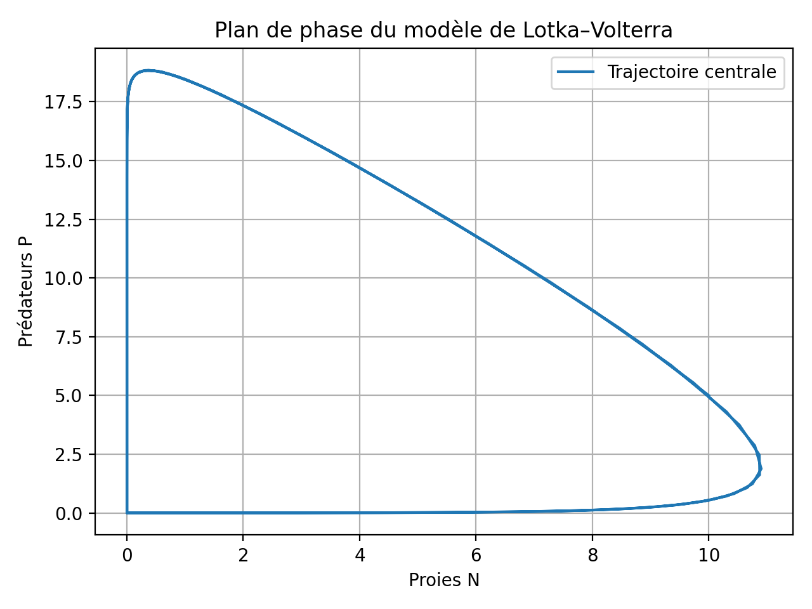
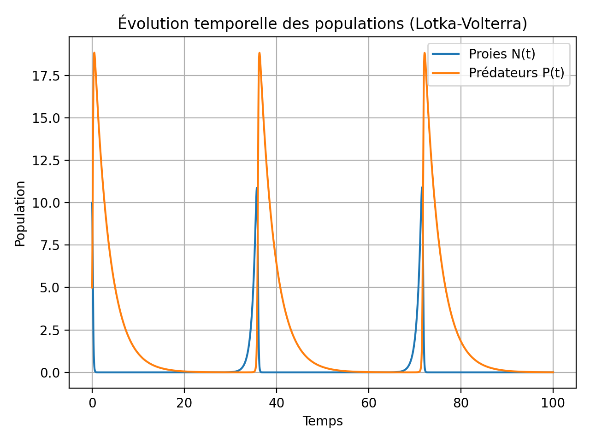
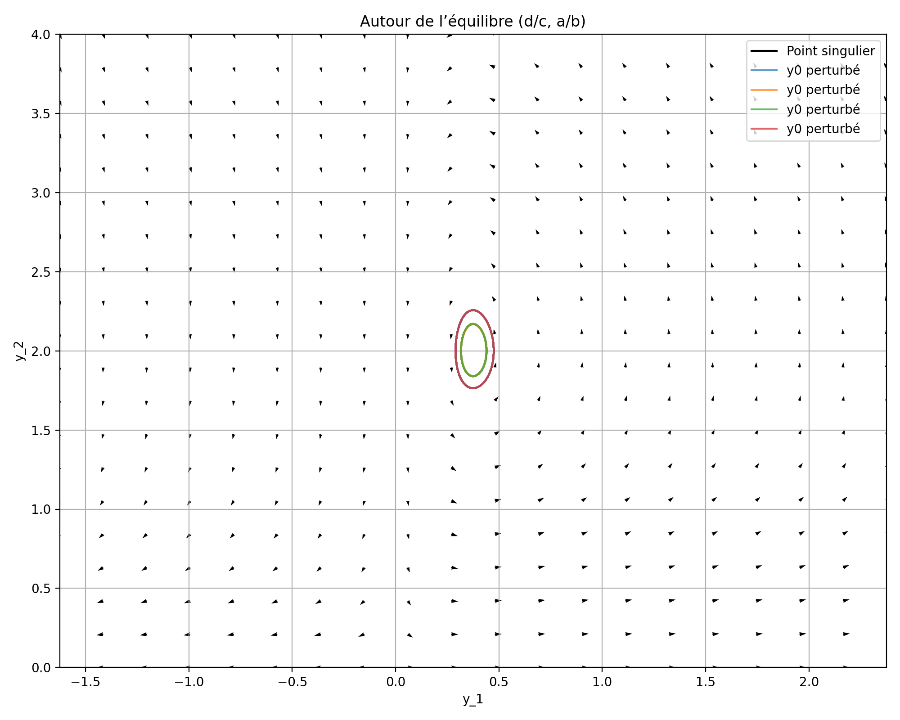
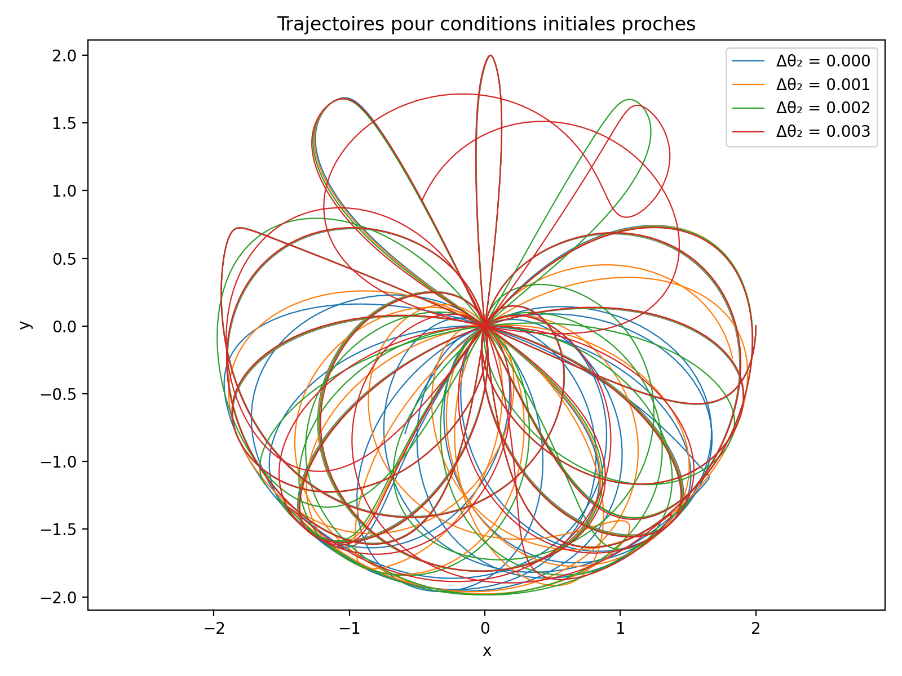

# Numerical ODE Solvers and Dynamical Systems

This project implements one-step numerical methods for ordinary differential equations (ODEs) in Python and applies them to several dynamical systems: a prey–predator Lotka–Volterra model and pendulum systems (simple and double). 

## Core ODE toolkit

Implemented in `part1.py`: 

- **CauchyProblem** class to encapsulate an IVP \(y'(t) = f(y,t),\ y(t_0)=y_0\) for arbitrary dimension.
- One-step methods:
  - Explicit Euler
  - Midpoint
  - Heun
  - Runge–Kutta of order 4 (`step_rk4`)
- Generic drivers:
  - `meth_n_step` for fixed time step integration over \(N\) steps.
  - `meth_epsilon` for adaptive step size based on a local error tolerance \(\varepsilon\).
- **Vector field plotting**: `draw_vector_field` to visualize 2D tangent fields and trajectories.

### Accuracy results

For test problems with known analytic solutions (e.g. \(y'(t) = y/(1+t^2),\ y(0)=1\)), the code: 

- Compares all methods against the exact solution.
- Plots solution curves and log-scale absolute errors.
- Confirms the expected hierarchy of accuracy: Euler < Midpoint ≈ Heun < RK4, with RK4 giving the smallest error for a given step size.

## Population dynamics: Lotka–Volterra

Implemented in `part2a.py` using `CauchyProblem`, `step_rk4`, and `meth_n_step`: 

- Models:
  - Exponential growth (Malthus) and logistic growth (Verhulst) with closed-form exact solutions for validation.
  - Prey–predator system:
    \[
      \dot N = N(a - bP),\quad \dot P = P(cN - d)
    \]

### Key results

- **Malthus vs Verhulst**:
  - For several initial populations \(N_0\), numerical RK4 solutions match the analytic curves very closely, confirming correctness of the solver. 
- **Lotka–Volterra time series**:
  - The prey \(N(t)\) and predator \(P(t)\) populations oscillate periodically with a phase shift: prey peaks occur before predator peaks. 
- **Phase plane**:
  - The trajectory \((N(t), P(t))\) lies on closed orbits, illustrating a conserved quantity and the non-damped, recurrent nature of the classical Lotka–Volterra model. 
- **Local behavior**:
  - Vector fields and trajectories around:
    - A specific initial state \(y_0 = (10,5)\)
    - The non-trivial equilibrium \((d/c,\ a/b)\)
  - show periodic orbits and sensitivity to small perturbations in initial conditions. 
- **Estimated period**:
  - The code detects successive maxima of \(N(t)\) and estimates an average oscillation period for the prey–predator cycle. 

## Pendulum dynamics

Implemented mainly in `part2b.py` and `part2b-b.py`: 

### Double pendulum: chaos and sensitivity

Using RK4 integration (`part2b.py`) and an animation based on `solve_ivp` (`part2b-b.py`): 

- State variables: \((\theta_1,\omega_1,\theta_2,\omega_2)\) for two masses connected by rigid rods.
- No closed-form solution; fully numerical integration.

Key visual results:

1. **Trajectories for nearby initial conditions** (`plot_multiple_trajectories`): 
   - Four trajectories of the second mass’s position \((x_2,y_2)\) with initial conditions
     \(\theta_1(0)=\pi/2,\ \theta_2(0)=\pi/2+\{0, 0.001, 0.002, 0.003\}\).
   - Paths diverge quickly, illustrating strong sensitivity to initial conditions and chaotic behavior.

2. **Fractal “first flip time” map** (`plot_flip_time_map`): 
   - Defines the **time of first flip** as the first time when \(|\theta_2(t)| > \pi\).
   - Scans a grid of initial angles \((\theta_1(0), \theta_2(0))\) and records this time.
   - Produces a color map where:
     - Dark regions flip almost immediately.
     - Light regions remain stable longer.
   - The map exhibits a fractal-like structure, highlighting the chaotic nature of the double pendulum.

3. **Animation of the double pendulum** (`part2b-b.py`): 
   - Uses `matplotlib.animation.FuncAnimation` to show the evolving configuration of the double pendulum over time.

,\theta_2(0))\) plane") 

## How to run

This project uses Python and NumPy/Matplotlib/Scipy.

